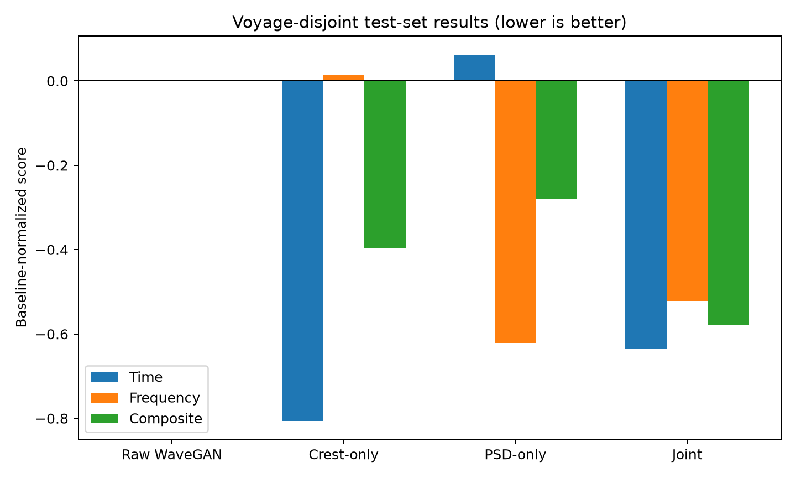
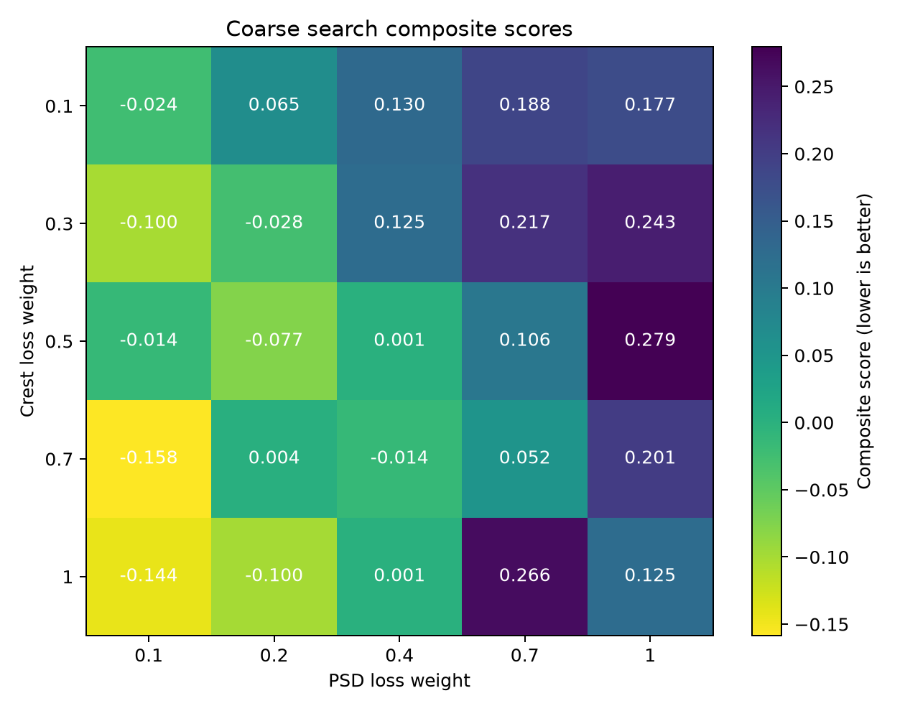
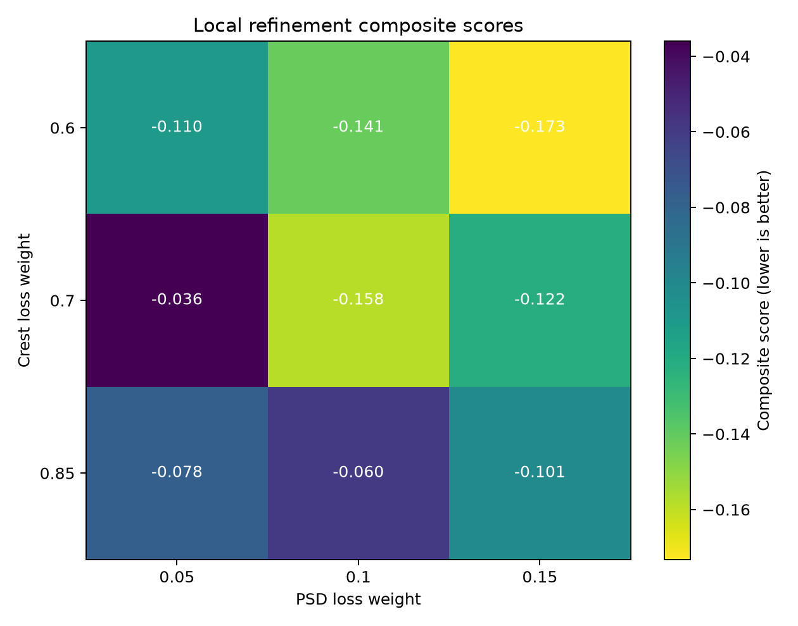
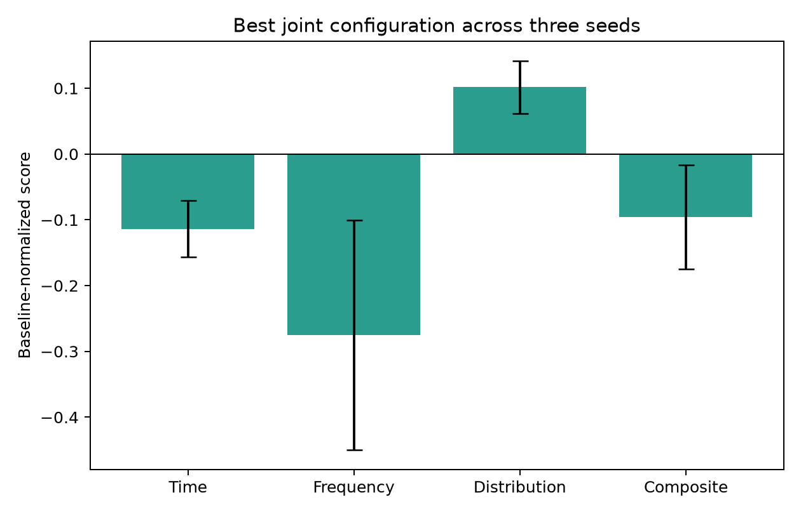
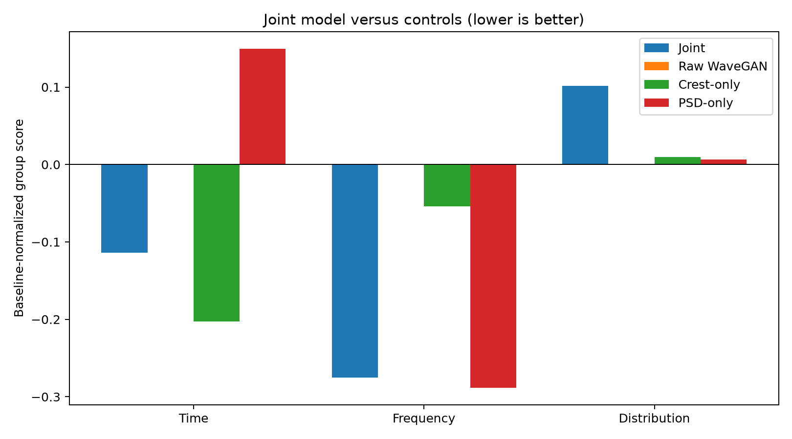
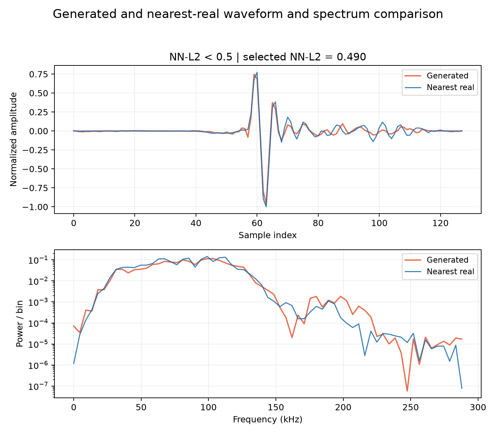
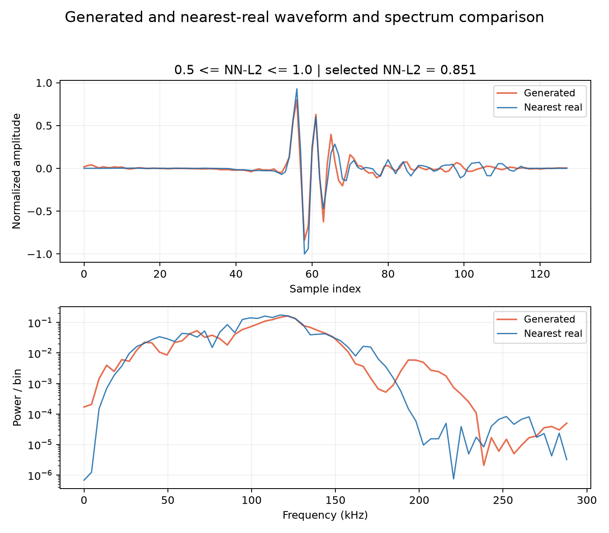
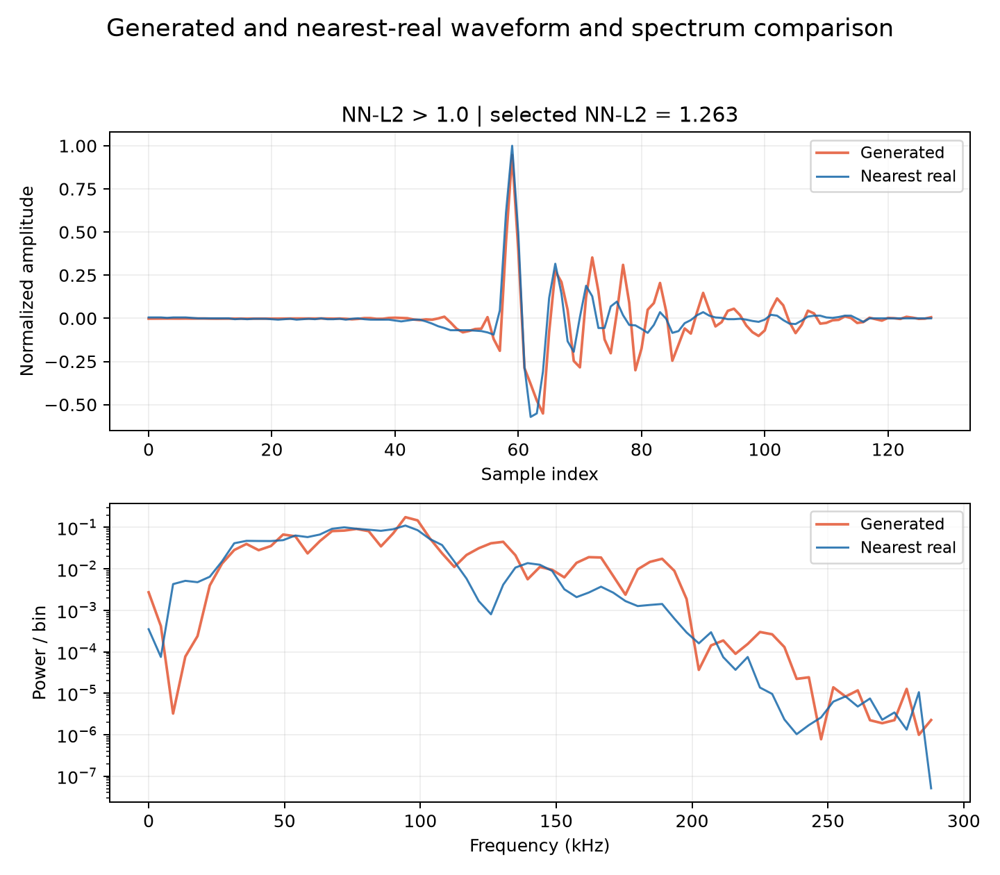

# 航次互斥 80/20 十五种子实验报告

测试航次：Voyage_Ori_02、Voyage_Ori_08、Voyage_Ori_15。训练 click 14734 条，测试 click 3684 条。

综合分沿用当前报告口径：时域（峰值、峰峰值、RMS、FWHM）与频域（log-PSD、-3 dB 带宽）组内分别取相对原始 WaveGAN 的对数比值均值，再等权平均；越低越好。

| 模型 | Crest | PSD | 时域分 | 频域分 | 综合分 |
| --- | ---: | ---: | ---: | ---: | ---: |
| Raw WaveGAN | 0.0 | 0.0 | 0.0000 | 0.0000 | 0.0000 |
| Crest-only | 1.0 | 0.0 | -0.8058 | 0.0132 | -0.3963 |
| PSD-only | 0.0 | 0.4 | 0.0628 | -0.6219 | -0.2796 |
| Joint | 0.6 | 0.15 | -0.6342 | -0.5223 | -0.5782 |

| 指标 | Raw WaveGAN | Crest-only | PSD-only | Joint |
| --- | ---: | ---: | ---: | ---: |
| peak_amplitude | 0.096307 ± 0.00865 | 0.026075 ± 0.00797 | 0.12913 ± 0.00677 | 0.049766 ± 0.0062 |
| peak_to_peak | 0.096694 ± 0.0189 | 0.036596 ± 0.0181 | 0.14032 ± 0.0153 | 0.061325 ± 0.0147 |
| rms | 0.0081046 ± 0.00172 | 0.0088925 ± 0.00188 | 0.0063124 ± 0.00107 | 0.0062291 ± 0.00135 |
| fwhm_samples | 0.45419 ± 0.0806 | 0.1609 ± 0.0573 | 0.38528 ± 0.0316 | 0.14266 ± 0.0209 |
| log_psd | 0.26963 ± 0.0176 | 0.30757 ± 0.0193 | 0.1016 ± 0.0168 | 0.11341 ± 0.0128 |
| minus_3db_bandwidth_hz | 3561.5 ± 1.02e+03 | 3205.5 ± 844 | 2724.6 ± 368 | 2979.4 ± 686 |

## NN-L2 波形近邻距离

NN-L2 采用逐波形 min-max 归一化到 [-1, 1] 后的 128 点 L2 距离，越低越好；不纳入综合分。单元格为十五个种子的均值 ± 标准差。

| 模型 | 生成→真实 NN-L2 | 真实→生成 NN-L2 |
| --- | ---: | ---: |
| Raw WaveGAN | 1.4504 ± 0.0289 | 1.3688 ± 0.0353 |
| Crest-only | 1.3345 ± 0.0315 | 1.6647 ± 0.0917 |
| PSD-only | 1.3874 ± 0.0408 | 1.5092 ± 0.0774 |
| Joint | 1.3098 ± 0.0229 | 1.633 ± 0.108 |

## 每个随机种子的测试结果

以下指标均在同一独立测试集上计算；评分相对五个原始 WaveGAN 种子的指标均值，越低越好。

### Raw WaveGAN（Crest=0.0，PSD=0.0）
| Seed | peak_amplitude | peak_to_peak | rms | fwhm_samples | log_psd | minus_3db_bandwidth_hz | Generated→Real NN-L2 | Real→Generated NN-L2 | Time score | Frequency score | Composite score |
| ---: | ---: | ---: | ---: | ---: | ---: | ---: | ---: | ---: | ---: | ---: | ---: |
| 369 | 0.088744 | 0.075836 | 0.011745 | 0.53057 | 0.29781 | 2347.7 | 1.4782 | 1.4054 | 0.0504 | -0.1587 | -0.0541 |
| 370 | 0.082286 | 0.069995 | 0.0089798 | 0.34049 | 0.25231 | 3459.3 | 1.4165 | 1.3413 | -0.1665 | -0.0478 | -0.1071 |
| 371 | 0.085743 | 0.072369 | 0.010108 | 0.45305 | 0.28011 | 4697.9 | 1.4316 | 1.3245 | -0.0469 | 0.1575 | 0.0553 |
| 372 | 0.10244 | 0.12348 | 0.0073305 | 0.30637 | 0.23857 | 2355 | 1.4629 | 1.3464 | -0.0470 | -0.2680 | -0.1575 |
| 373 | 0.10234 | 0.10421 | 0.006326 | 0.54576 | 0.30023 | 3280.9 | 1.41 | 1.3774 | 0.0179 | 0.0127 | 0.0153 |
| 374 | 0.092328 | 0.078377 | 0.010346 | 0.49189 | 0.28005 | 2598.1 | 1.489 | 1.4254 | 0.0179 | -0.1387 | -0.0604 |
| 375 | 0.092838 | 0.080607 | 0.0079154 | 0.4662 | 0.27587 | 4155.5 | 1.4497 | 1.3886 | -0.0540 | 0.0886 | 0.0173 |
| 376 | 0.087531 | 0.093515 | 0.0071167 | 0.37218 | 0.25442 | 3889.3 | 1.429 | 1.3069 | -0.1145 | 0.0150 | -0.0498 |
| 377 | 0.093857 | 0.093393 | 0.0088414 | 0.40419 | 0.26145 | 3552.1 | 1.4666 | 1.3596 | -0.0225 | -0.0167 | -0.0196 |
| 378 | 0.10892 | 0.12601 | 0.0071785 | 0.48468 | 0.2642 | 2138.8 | 1.478 | 1.3799 | 0.0829 | -0.2651 | -0.0911 |
| 379 | 0.10634 | 0.10775 | 0.0088026 | 0.55106 | 0.26264 | 2952.4 | 1.4851 | 1.4015 | 0.1208 | -0.1069 | 0.0069 |
| 380 | 0.10067 | 0.10122 | 0.0079288 | 0.59983 | 0.28732 | 2903.5 | 1.4932 | 1.4142 | 0.0866 | -0.0704 | 0.0081 |
| 381 | 0.094644 | 0.099204 | 0.0076855 | 0.45855 | 0.28113 | 4518.3 | 1.4276 | 1.3934 | -0.0088 | 0.1399 | 0.0655 |
| 382 | 0.11304 | 0.13131 | 0.0046261 | 0.42756 | 0.24808 | 5694.6 | 1.4208 | 1.3442 | -0.0387 | 0.1930 | 0.0771 |
| 383 | 0.092882 | 0.093128 | 0.0066399 | 0.38048 | 0.26027 | 4878.7 | 1.4172 | 1.3229 | -0.1126 | 0.1397 | 0.0136 |

### Crest-only（Crest=1.0，PSD=0.0）
| Seed | peak_amplitude | peak_to_peak | rms | fwhm_samples | log_psd | minus_3db_bandwidth_hz | Generated→Real NN-L2 | Real→Generated NN-L2 | Time score | Frequency score | Composite score |
| ---: | ---: | ---: | ---: | ---: | ---: | ---: | ---: | ---: | ---: | ---: | ---: |
| 369 | 0.033794 | 0.028487 | 0.0068236 | 0.11008 | 0.31484 | 2425.9 | 1.3318 | 1.6386 | -0.9647 | -0.1145 | -0.5396 |
| 370 | 0.01015 | 0.024816 | 0.013404 | 0.19525 | 0.27689 | 3516.7 | 1.3434 | 1.8387 | -0.9878 | 0.0070 | -0.4904 |
| 371 | 0.02951 | 0.036664 | 0.0093948 | 0.15157 | 0.34266 | 3384.8 | 1.3065 | 1.6789 | -0.7756 | 0.0944 | -0.3406 |
| 372 | 0.024585 | 0.071485 | 0.0070905 | 0.086402 | 0.34105 | 4349.8 | 1.3015 | 1.7144 | -0.8652 | 0.2175 | -0.3238 |
| 373 | 0.026756 | 0.034673 | 0.0098714 | 0.19117 | 0.28301 | 2108.3 | 1.3234 | 1.7232 | -0.7436 | -0.2379 | -0.4908 |
| 374 | 0.034354 | 0.061727 | 0.0050274 | 0.1054 | 0.30977 | 2537.1 | 1.3785 | 1.573 | -0.8545 | -0.1002 | -0.4773 |
| 375 | 0.025897 | 0.013824 | 0.01128 | 0.22472 | 0.2899 | 2820.4 | 1.3566 | 1.6155 | -0.9079 | -0.0804 | -0.4942 |
| 376 | 0.029088 | 0.033499 | 0.0078628 | 0.20668 | 0.32803 | 3784.2 | 1.2922 | 1.5986 | -0.7687 | 0.1283 | -0.3202 |
| 377 | 0.013947 | 0.01326 | 0.0088126 | 0.14143 | 0.2961 | 4609.9 | 1.2886 | 1.7432 | -1.2505 | 0.1758 | -0.5373 |
| 378 | 0.01673 | 0.03816 | 0.0097966 | 0.085527 | 0.28974 | 3018.3 | 1.3659 | 1.7493 | -1.0400 | -0.0468 | -0.5434 |
| 379 | 0.034574 | 0.017744 | 0.0083044 | 0.16641 | 0.29083 | 3798.9 | 1.3121 | 1.478 | -0.9249 | 0.0701 | -0.4274 |
| 380 | 0.033546 | 0.036394 | 0.0088361 | 0.22692 | 0.31867 | 2248.8 | 1.3346 | 1.6623 | -0.6598 | -0.1463 | -0.4031 |
| 381 | 0.032222 | 0.05253 | 0.0095579 | 0.19757 | 0.31601 | 3147.8 | 1.3505 | 1.6517 | -0.5931 | 0.0176 | -0.2878 |
| 382 | 0.01501 | 0.066387 | 0.0082621 | 0.067601 | 0.30701 | 4435.3 | 1.3286 | 1.7653 | -1.0301 | 0.1746 | -0.4278 |
| 383 | 0.03096 | 0.01929 | 0.0090636 | 0.25684 | 0.30903 | 1895.8 | 1.4028 | 1.5404 | -0.8013 | -0.2471 | -0.5242 |

### PSD-only（Crest=0.0，PSD=0.4）
| Seed | peak_amplitude | peak_to_peak | rms | fwhm_samples | log_psd | minus_3db_bandwidth_hz | Generated→Real NN-L2 | Real→Generated NN-L2 | Time score | Frequency score | Composite score |
| ---: | ---: | ---: | ---: | ---: | ---: | ---: | ---: | ---: | ---: | ---: | ---: |
| 369 | 0.12914 | 0.15451 | 0.0047009 | 0.39346 | 0.091398 | 3228.4 | 1.3823 | 1.5196 | 0.0185 | -0.5900 | -0.2858 |
| 370 | 0.1348 | 0.1516 | 0.0063043 | 0.38154 | 0.08226 | 2919.4 | 1.4297 | 1.5782 | 0.0901 | -0.6930 | -0.3014 |
| 371 | 0.13061 | 0.13468 | 0.0071256 | 0.36102 | 0.11736 | 2595.7 | 1.3882 | 1.4278 | 0.0694 | -0.5741 | -0.2523 |
| 372 | 0.12917 | 0.1502 | 0.0053487 | 0.34869 | 0.10383 | 2567.6 | 1.3615 | 1.4568 | 0.0135 | -0.6408 | -0.3136 |
| 373 | 0.13109 | 0.13326 | 0.0086842 | 0.41434 | 0.13376 | 3673 | 1.4244 | 1.6663 | 0.1516 | -0.3351 | -0.0918 |
| 374 | 0.1179 | 0.11062 | 0.0075566 | 0.43609 | 0.096728 | 2452.8 | 1.3287 | 1.4518 | 0.0565 | -0.6991 | -0.3213 |
| 375 | 0.1374 | 0.15233 | 0.0052403 | 0.33586 | 0.083049 | 2658 | 1.3516 | 1.428 | 0.0180 | -0.7351 | -0.3586 |
| 376 | 0.11843 | 0.11917 | 0.0065945 | 0.40565 | 0.094074 | 2224.3 | 1.3322 | 1.4495 | 0.0241 | -0.7618 | -0.3689 |
| 377 | 0.13703 | 0.1546 | 0.0061371 | 0.41916 | 0.079668 | 2829 | 1.4083 | 1.6205 | 0.1159 | -0.7247 | -0.3044 |
| 378 | 0.1273 | 0.14589 | 0.0059723 | 0.32991 | 0.13448 | 2201.1 | 1.4121 | 1.5018 | 0.0163 | -0.5884 | -0.2860 |
| 379 | 0.13863 | 0.15975 | 0.0065899 | 0.37297 | 0.087265 | 2680 | 1.4193 | 1.5555 | 0.1156 | -0.7062 | -0.2953 |
| 380 | 0.12285 | 0.11829 | 0.0057318 | 0.36611 | 0.11517 | 3073.3 | 1.3576 | 1.427 | -0.0292 | -0.4990 | -0.2641 |
| 381 | 0.13708 | 0.15688 | 0.0078403 | 0.42768 | 0.095173 | 2527.3 | 1.4826 | 1.6207 | 0.1859 | -0.6922 | -0.2531 |
| 382 | 0.12289 | 0.13283 | 0.0056783 | 0.3899 | 0.10769 | 2616.4 | 1.3519 | 1.4618 | 0.0132 | -0.6131 | -0.2999 |
| 383 | 0.12267 | 0.13019 | 0.0051805 | 0.39689 | 0.10213 | 2622.6 | 1.3809 | 1.4721 | -0.0108 | -0.6384 | -0.3246 |

### Joint（Crest=0.6，PSD=0.15）
| Seed | peak_amplitude | peak_to_peak | rms | fwhm_samples | log_psd | minus_3db_bandwidth_hz | Generated→Real NN-L2 | Real→Generated NN-L2 | Time score | Frequency score | Composite score |
| ---: | ---: | ---: | ---: | ---: | ---: | ---: | ---: | ---: | ---: | ---: | ---: |
| 369 | 0.054394 | 0.072776 | 0.0054188 | 0.13396 | 0.11207 | 2957.2 | 1.3285 | 1.6127 | -0.6197 | -0.5319 | -0.5758 |
| 370 | 0.054472 | 0.043611 | 0.0075686 | 0.18485 | 0.11684 | 3044 | 1.3421 | 1.4061 | -0.5834 | -0.4966 | -0.5400 |
| 371 | 0.05711 | 0.049381 | 0.0061358 | 0.14622 | 0.12607 | 3202.8 | 1.3045 | 1.4896 | -0.6516 | -0.4332 | -0.5424 |
| 372 | 0.042306 | 0.077262 | 0.0052114 | 0.099481 | 0.095123 | 2913.3 | 1.2911 | 1.7212 | -0.7518 | -0.6214 | -0.6866 |
| 373 | 0.037311 | 0.03565 | 0.0091235 | 0.17232 | 0.14176 | 3388.4 | 1.2931 | 1.8054 | -0.6992 | -0.3464 | -0.5228 |
| 374 | 0.042258 | 0.054735 | 0.0066294 | 0.16465 | 0.10474 | 1523.2 | 1.2901 | 1.6828 | -0.6521 | -0.8975 | -0.7748 |
| 375 | 0.053069 | 0.068096 | 0.0044742 | 0.12026 | 0.10206 | 4129.9 | 1.3185 | 1.5175 | -0.7174 | -0.4117 | -0.5645 |
| 376 | 0.049721 | 0.050167 | 0.0066053 | 0.13228 | 0.10891 | 2640.9 | 1.273 | 1.5878 | -0.6889 | -0.6028 | -0.6458 |
| 377 | 0.055337 | 0.076731 | 0.0053988 | 0.1535 | 0.11275 | 4033.4 | 1.2957 | 1.7231 | -0.5691 | -0.3737 | -0.4714 |
| 378 | 0.041013 | 0.047597 | 0.0081359 | 0.13952 | 0.11717 | 2331.8 | 1.3255 | 1.7265 | -0.6847 | -0.6285 | -0.6566 |
| 379 | 0.045357 | 0.066181 | 0.0073792 | 0.15281 | 0.096293 | 3528.9 | 1.304 | 1.7726 | -0.5788 | -0.5194 | -0.5491 |
| 380 | 0.054398 | 0.061785 | 0.0048954 | 0.13193 | 0.12508 | 2272 | 1.3156 | 1.5666 | -0.6899 | -0.6088 | -0.6493 |
| 381 | 0.049963 | 0.066859 | 0.006665 | 0.11999 | 0.096569 | 2502.9 | 1.319 | 1.6879 | -0.6380 | -0.6898 | -0.6639 |
| 382 | 0.055427 | 0.093119 | 0.0042002 | 0.1428 | 0.12199 | 3697.5 | 1.2844 | 1.6123 | -0.6011 | -0.3778 | -0.4895 |
| 383 | 0.054349 | 0.05592 | 0.005595 | 0.14526 | 0.12366 | 2524.8 | 1.3622 | 1.5829 | -0.6576 | -0.5618 | -0.6097 |

## 暂存：十种子事后敏感性分析

此表同时排除 seeds 371、373、379、382、383，仅用于查看排除后的数值变化，不替代完整十五种子正式结论。

| 模型 | 时域分 | 频域分 | 综合分 |
| --- | ---: | ---: | ---: |
| Raw WaveGAN | 0.0000 | 0.0000 | 0.0000 |
| Crest-only | -0.8080 | 0.0757 | -0.3661 |
| PSD-only | 0.0616 | -0.5972 | -0.2678 |
| Joint | -0.6412 | -0.5110 | -0.5761 |

| 指标 | Raw WaveGAN | Crest-only | PSD-only | Joint |
| --- | ---: | ---: | ---: | ---: |
| peak_amplitude | 0.094427 ± 0.0074 | 0.025431 ± 0.00847 | 0.12911 ± 0.00714 | 0.049693 ± 0.00544 |
| peak_to_peak | 0.094164 ± 0.0182 | 0.037418 ± 0.0184 | 0.14141 ± 0.017 | 0.061962 ± 0.0117 |
| rms | 0.0085067 ± 0.00144 | 0.0088491 ± 0.00225 | 0.0061427 ± 0.00094 | 0.0061003 ± 0.00114 |
| fwhm_samples | 0.44549 ± 0.0853 | 0.158 ± 0.055 | 0.38442 ± 0.0364 | 0.13804 ± 0.0231 |
| log_psd | 0.26931 ± 0.0173 | 0.3081 ± 0.0187 | 0.097583 ± 0.0159 | 0.10913 ± 0.00908 |
| minus_3db_bandwidth_hz | 3191.8 ± 796 | 3245.9 ± 765 | 2668.1 ± 325 | 2834.9 ± 749 |

## Addition：保留记录与产出溯源

### A. 整理后保留的实验记录

本目录保留两层实验记录：

1. `runs/`、`controls/`、`results/`、`images/` 和 `checkpoints/` 保存初始粗搜索、局部细搜索和三种子复验。这些记录用于说明联合权重 `Crest=0.6、PSD=0.15` 的搜索来源。
2. `voyage_split_full/` 保存固定航次互斥 80/20 划分下，Raw WaveGAN、Crest-only、PSD-only 和 Joint 四种方法在 seeds 369–383 上的 60 组正式训练与独立测试结果。这一层是当前报告结论的依据。

初始搜索图采用 `run_weight_search.py` 中的历史评分口径，其中包含后来从正式评分中删除的指标。因此，初始搜索图只用于追溯权重筛选过程，不能与本报告十五种子的时域分、频域分和综合分直接比较。当前正式评分只使用峰值、峰峰值、RMS、FWHM、log-PSD 和 -3 dB 带宽距离。

历史总控日志、旧版报告和一次性 -3 dB 指标刷新脚本已归档到 `archive/initial_weight_search/`；十五种子正式实验的两份总控日志已归入 `voyage_split_full/logs/`。逐次训练和评估日志仍保留在对应 run 目录中。

### B. 值得保留的图表记录

下图是当前十五种子、航次互斥测试集上的正式评分汇总；数据来自 60 个 `metrics.json`，由 `summarize_voyage_split_experiment.py` 计算并绘制。



以下四图为初始搜索过程记录，只说明候选权重如何产生，不作为当前正式评分证据。









以下三张 NN-L2 波形与频谱图来自初始搜索代表 checkpoint，并在完整 `data/wav` 上寻找最近真实波形。它们是生成样本的定性示例，不是航次互斥测试集上的统计图，也不参与当前综合分。







### C. 从数据到产出的处理链

```text
data/wav + 航次定位目录
  -> prepare_voyage_split.py
  -> split/train_files.txt、split/test_files.txt、split/split.json

train_files.txt + 方法权重 + seed
  -> run_voyage_split_experiment.py
  -> train_wavegan_torch.py
  -> checkpoint、preview WAV、epochs.jsonl、training.log、training_losses.png

checkpoint + test_files.txt + 固定 evaluation seed 369
  -> evaluate_wavegan_torch.py
  -> metrics.json、evaluation.log、feature_distributions.png、mean_psd_comparison.png

60 个 metrics.json + split.json
  -> summarize_voyage_split_experiment.py
  -> summary.json、summary.csv、score_comparison.png、本报告主体表格
```

### D. 各产出的代码溯源

| 产出 | 直接输入 | 生成代码与关键步骤 | 用途 |
| --- | --- | --- | --- |
| `voyage_split_full/split/train_files.txt` | `data/wav` 中 18,418 条 WAV；航次定位目录中的 `Voyage_Ori_*/PulseTrain_*` 映射 | `prepare_voyage_split.py`：从文件名提取 PulseTrain，映射到航次；排除固定测试航次后写出 14,734 条训练路径 | 四种方法、十五种子的共同训练集 |
| `voyage_split_full/split/test_files.txt` | 同上 | `prepare_voyage_split.py`：将 Voyage_Ori_02、08、15 的 3,684 条 click 写入固定测试列表 | 所有种子共享的独立测试集 |
| `voyage_split_full/split/split.json` | 上述划分结果 | `prepare_voyage_split.py`：记录训练/测试航次、样本数和测试比例 | 汇总程序读取测试航次与样本数 |
| `voyage_split_full/runs/<方法>/seed_<种子>/epochs.jsonl` | `train_files.txt`、权重、seed、200 epochs | `run_voyage_split_experiment.py` 调用 `train_wavegan_torch.py`；后者逐 epoch 写入 D loss、G adversarial loss、原始及加权 Crest/PSD loss 和总 G loss | 训练过程的原始数值记录 |
| 每组 `training.log` | 训练进程标准输出和错误输出 | `run_voyage_split_experiment.py::run_logged` 原样记录 `train_wavegan_torch.py` 输出 | 追踪训练进度和报错 |
| 每组 `checkpoints/wavegan_epoch_0200.pt` | 第 200 epoch 的生成器、判别器和优化器状态 | `train_wavegan_torch.py::save_checkpoint` | 该方法与种子的最终模型 |
| 每组 `checkpoints/preview_epoch_0200.wav` | 最终生成器与训练开始时固定的 latent noise | `train_wavegan_torch.py::save_preview` | 快速试听最终生成结果 |
| 每组 `images/training_losses.png` | 同组 `epochs.jsonl` | `train_wavegan_torch.py::plot_training_losses` 读取逐 epoch loss 并绘图 | 检查训练收敛趋势 |
| 每组 `metrics.json` | 同组 epoch 200 checkpoint、`test_files.txt`、evaluation seed 369 | `run_voyage_split_experiment.py` 调用 `evaluate_wavegan_torch.py`；固定 latent 生成与测试样本等量的 click，计算波形、频谱、-3 dB 带宽和双向 NN-L2 | 正式评分与表格的原始指标 |
| 每组 `evaluation.log` | 评估进程标准输出和错误输出 | `run_voyage_split_experiment.py::run_logged` 原样记录 `evaluate_wavegan_torch.py` 输出 | 追踪评估过程 |
| 每组 `images/feature_distributions.png` | 测试集与该 checkpoint 生成样本的波形特征 | `evaluate_wavegan_torch.py` 调用共享评估器 `plot_feature_distributions` | 检查各波形特征分布差异 |
| 每组 `images/mean_psd_comparison.png` | 测试集与生成样本的平均 PSD | `evaluate_wavegan_torch.py` 调用共享评估器 `plot_mean_psd` | 检查平均频谱差异 |
| `voyage_split_full/results/summary.json` | 60 个 `metrics.json` 和 `split.json` | `summarize_voyage_split_experiment.py`：按方法聚合十五种子均值、标准差、逐种子得分和 NN-L2 | 机器可读的完整汇总 |
| `voyage_split_full/results/summary.csv` | 与 `summary.json` 相同 | `summarize_voyage_split_experiment.py` 将方法级均值、标准差和得分展平为 CSV | 表格分析与外部绘图 |
| `voyage_split_full/results/score_comparison.png` | `summary.json` 中四种方法的时域分、频域分和综合分 | `summarize_voyage_split_experiment.py` 绘制分组柱状图；Raw WaveGAN 为归一化零点 | 当前正式评分对比图 |
| 本报告主体表格 | `summary.json`、`split.json` | `summarize_voyage_split_experiment.py` 生成总体表、NN-L2 表、60 组逐种子表和十种子敏感性表 | 当前正式实验记录 |
| 三张 `images/nn_l2_ranges/*.png` | `checkpoints/best/representative_lowest_score.pt`、完整 `data/wav`、seed 369、16,384 个候选生成样本 | `plot_nearest_waveforms.py`：逐波形归一化到 [-1,1]，对每个生成样本计算最近真实样本 L2；分别在 `<0.5`、`0.5–1.0`、`>1.0` 区间选中位候选，再绘制波形和单边功率谱 | 三个距离区间的定性示例 |
| `results/search_results.csv/json` | 初始联合运行的逐组 `metrics.json` 与 Raw WaveGAN 基线 | `run_weight_search.py::collect_rows`、`write_search_rows` | 初始搜索的完整数值记录 |
| `results/final_ranking.json`、`best_configuration.json` | 粗搜索、细搜索和三种子复验结果 | `run_weight_search.py::rank_weights`、`build_best_configuration` | 记录初始权重排名和代表 checkpoint |
| `images/coarse_search_heatmap.png` | seed 369 的 25 组粗搜索得分 | `run_weight_search.py::plot_heatmap` | 初始粗搜索路径记录 |
| `images/fine_search_heatmap.png` | 粗搜索第一名周围的 3×3 局部网格得分 | `run_weight_search.py::local_axis`、`plot_heatmap` | 初始局部细化路径记录 |
| `images/best_three_seed_error_bars.png` | 初始最佳权重 seeds 369、370、371 的分组得分 | `run_weight_search.py::plot_seed_error_bars` | 初始最佳组合的跨种子波动记录 |
| `images/joint_vs_controls.png` | 初始最佳联合模型与 Raw、Crest-only、PSD-only 的历史分组得分 | `run_weight_search.py::plot_final_comparison` | 初始搜索口径下的对照记录 |
| `checkpoints/best/` | 初始最佳权重三个种子的 epoch 200 checkpoint | `run_weight_search.py::copy_best_checkpoints`；最低历史综合分另复制为 `representative_lowest_score.pt` | 保存权重搜索选中的模型及 NN-L2 示例图输入 |
| `archive/initial_weight_search/logs/` | 初始搜索、恢复运行和指标刷新进程输出 | PowerShell 启动命令与各 Python 脚本的标准输出/错误输出 | 追踪长时间搜索执行过程 |
| `voyage_split_full/logs/` | 前五种子与追加十种子的总控输出 | `run_voyage_split_experiment.py` 的两次启动日志 | 追踪十五种子正式实验执行过程 |

### E. 清理记录

已删除 Python 字节码缓存、4 个零字节 stderr 日志，以及 3 张被当前 NN-L2 分区图替代且未被报告引用的旧版合成图。上述删除项没有独立实验数值，删除后不可从当前目录直接恢复；所有原始训练记录、评估指标、有效日志、checkpoint 和当前报告引用图均已保留。
